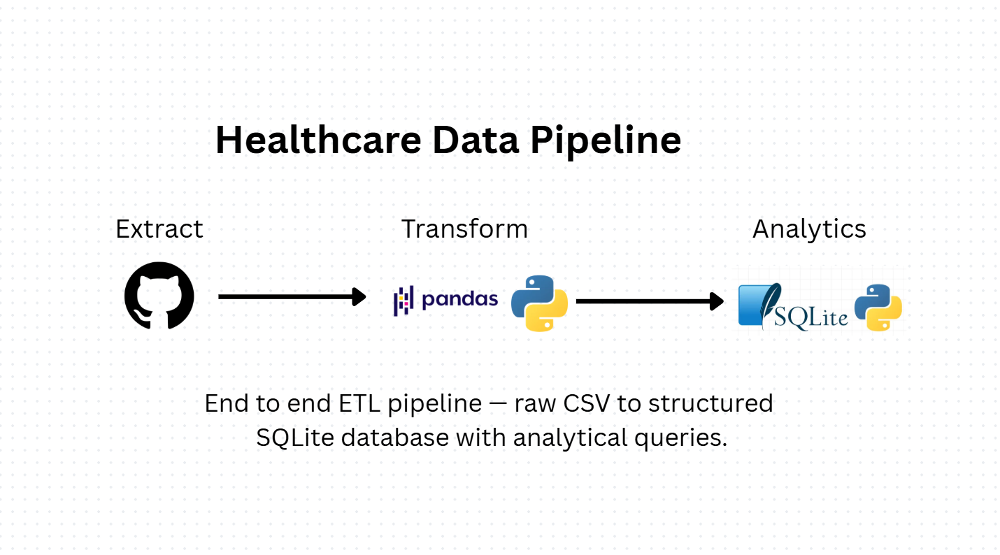

# Healthcare Data Pipeline
 
End to end ETL pipeline — raw CSV to structured SQLite database with analytical queries.

## Pipeline
 

 
---
## What it does
 
Pulls a messy healthcare CSV from GitHub, cleans it, loads it into SQLite, and runs SQL queries to show patient insights.
 
---
 
## Stack
 
- **Python** — ETL 
- **pandas** — data cleaning and transformation
- **SQLite** — local database storage
---
 
## How to run
 
```bash
pip install pandas requests
 
# Step 1 — clean and load
python main.py
 
# Step 2 — run analysis
python analysis.py
```
 
---
 
## Data source
 
[eyowhite/Messy-dataset](https://github.com/eyowhite/Messy-dataset) — synthetic messy healthcare CSV.
